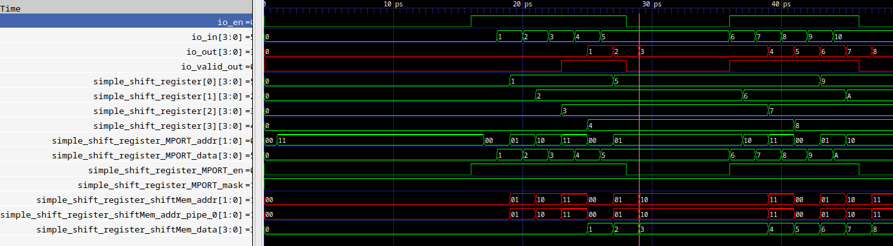
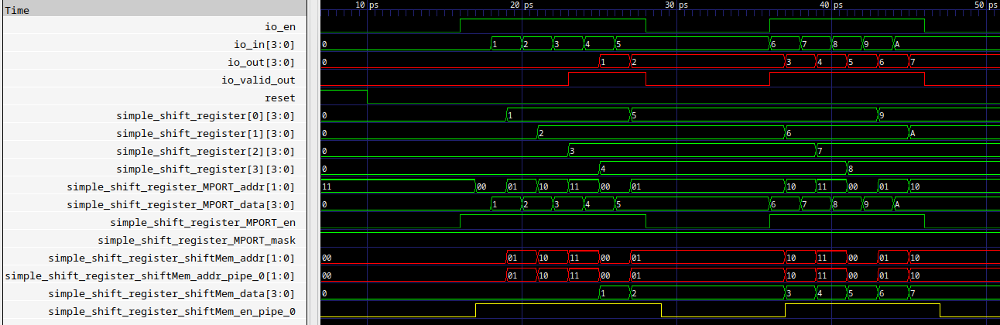
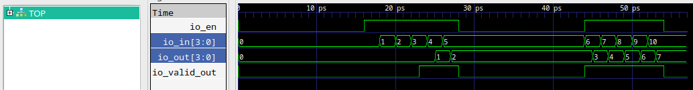
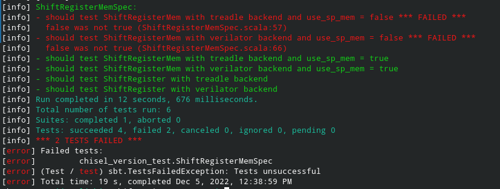

Demonstration of output differences between two different Chisel versions for `ShiftRegisterMem`
===================

This repository contains `ShiftRegisterMemExample` module accompanied with an appropriate test cases that validate [ShiftRegisterMem](https://github.com/ucb-bar/dsptools/blob/master/rocket/src/main/scala/craft/ShiftRegisterMem.scala) object. The original `ShiftRegisterMem` object is extended with single port SRAM implementation. The code snippet for dual port SRAM implementation is unchanged.

This design is tested with two different backends (`treadle` and `verilator`) and waveform diagrams for the given example are generated and presented in this repository.

Waverform diagram of `ShiftRegisterMem` object as a result of tests execution with **Chisel version 3.4.4** (verilator backend):


Waverform diagram of `ShiftRegisterMem` object as a result of tests execution with **Chisel version 3.4.3** (verilator backend):


Presented diagrams show that the `SyncReadMem` behaves differently for different Chisel versions (Chisel version 3.4.3 gives the correct output). There are indications that [commit 18e607](https://github.com/chipsalliance/chisel3/commit/18e6077ff935e464850132263fab4c7a06bcb4df) caused this tests failure. This issue leads to incorrect simulation behaviour of designs where `ShiftRegisterMem` object is extensively used.

If `ShiftRegisterMem` is replaced with simple `ShiftRegister` object from `chisel3.util` library or when a single port SRAM implementation is used, all tests pass without errors for both of the mentioned backends. The diagram is presented below:



## Setup

```
git clone https://github.com/milovanovic/ShiftRegisterMemDemo.git
cd ShiftRegisterMemDemo
git submodule update --init --recursive
```

```
//to run tests
sbt test
```

The output should look like:


