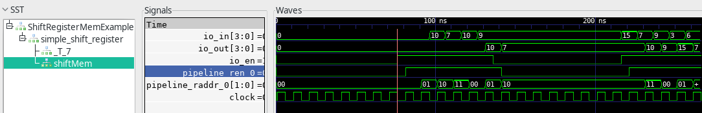
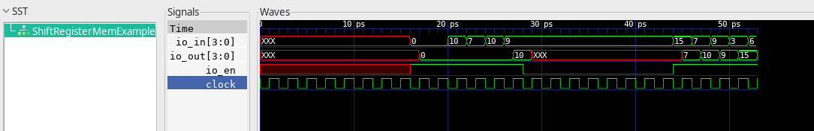
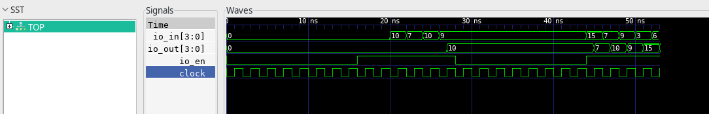

Demonstration of output differences between three simulation backends for ShiftRegisterMem
===================

This repository contains `ShiftRegisterMemExample` module accompanied with an appropriate test cases that validate [ShiftRegisterMem](https://github.com/ucb-bar/dsptools/blob/master/rocket/src/main/scala/craft/ShiftRegisterMem.scala) object.

This design is tested with three different backends (`firrtl`, `treadle` and `verilator`). 

Waveform diagrams for the given example are generated and presented below.

Waveform diagram generated for `treadle` backend

Waveform diagram generated for `firrtl` backend

Waveform diagram generated for `verilator` backend

The diagrams show that there are some mismatches between those three backends. More precisely, for the treadle backend, wrong value is held when the enable signal is deasserted.

This issue leads to incorrect simulation behaviour of designs where `ShiftRegisterMem` object is extensively used.

If `ShiftRegisterMem` is replaced with simple `ShiftRegister` object from `chisel3.util` library all tests pass without errors for all above mentioned backends (no differences between the three are observed).
