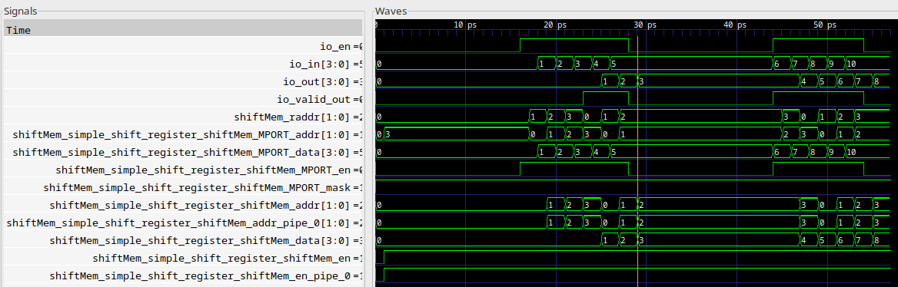
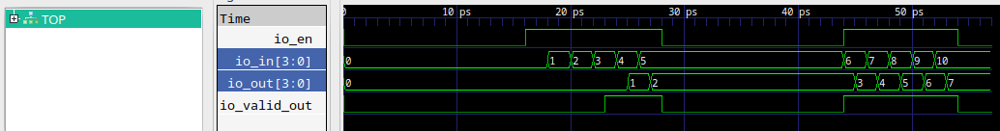
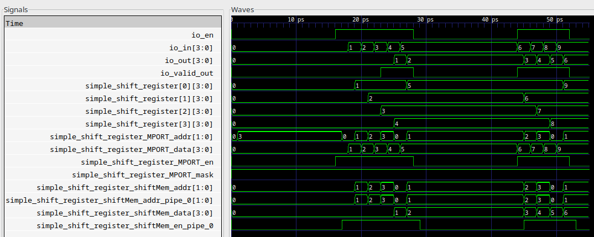

Demonstration of output differences between two different chipyard releases for ShiftRegisterMem
===================

This repository contains `ShiftRegisterMemExample` module accompanied with an appropriate test cases that validate [ShiftRegisterMem](https://github.com/ucb-bar/dsptools/blob/master/rocket/src/main/scala/craft/ShiftRegisterMem.scala) object.

This design is tested with two different backends (`treadle` and `verilator`).
Waveform diagrams for the given example are generated and presented below.

Results for the ShiftRegisterMem (waveform diagram generated for `verilator` backend) - tests fails:



If `ShiftRegisterMem` is replaced with simple `ShiftRegister` object from `chisel3.util` library, all tests pass without errors for both mentioned backends. Diagram is presented below:



If tools versions are compatible with chipyard < 1.5.0 release there are no problems with ShiftRegisterMem object and all tests pass!!!
One waveform diagram for that case (verilator backend) is given bellow.


This issue leads to incorrect simulation behaviour of designs where `ShiftRegisterMem` object is extensively used.

## Setup

```
git clone --branch chipyard-release-diff https://github.com/milovanovic/ShiftRegisterMemDemo.git
cd ShiftRegisterMemDemo
//submodules init
git config --local submodule.sims/firesim.update none
git submodule update --init --recursive
git config --local --unset-all submodule.sims/firesim.update
git submodule update --init sims/firesim
```

Note: This is fast solution, it works but it generates dirty submodules, you can use:

    git status --ignore-submodules=dirty

or just ignore changes that are reported inside submodules (use git stash --all as an alternative).

